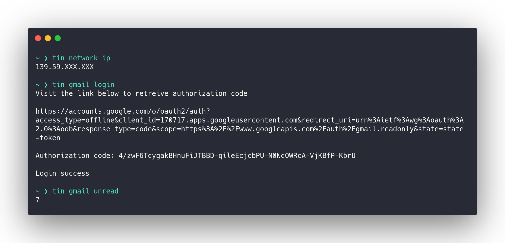

# Tin

Tin is a server that observes different [data sources](#data-sources) and act as a central place for the data to be queried. It collects the data at intervals and keeps the state in memory to prevent rate limiting from external data sources.

It can be used as a example by [Polybar](https://github.com/polybar/polybar) to fetch and display information.

The server itself exposes a gRPC interface and is intended to be run on the local system only.



## Quickstart

### Binaries

#### tin-server

The server exposes a gRPC interface on localhost on port 8717. The port can be changed using the --port flag.

#### tin

The CLI implements the gRPC client interface for interacting with the server. The port can be changed using the --port flag.

### Installation

The binaries will be placed at the GOBIN path.

```bash
make install
```

## Data sources

The data can be anything that is useful for the user.

### Operating system

| Data                     |  Supported |
| :----------------------- | ---------: |
| Temperature              | Void Linux |
| Available system updates | Void Linux |
| Installed packages       | Void Linux |

### Network

| Data      |  Supported |
| :-------- | ---------: |
| ESSID     | Void Linux |
| Public IP | Void Linux |

### Mail providers

| Data         | Supported |
| :----------- | --------: |
| Unread count |     Gmail |
